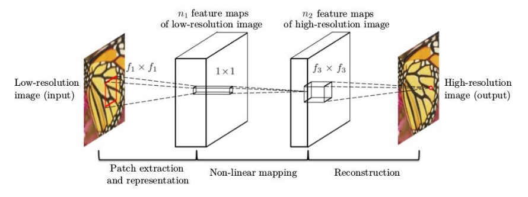
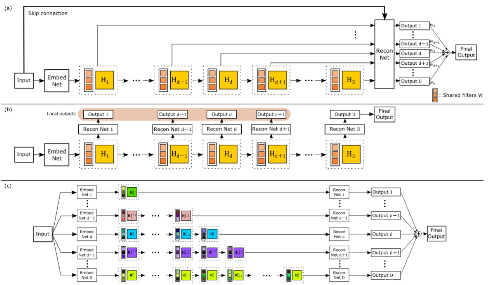

- Attention please: 

- **If you want to reprint my article, please mark the original address and author(刘书裴).**

- **If you are puzzled about a certain part or have some better suggestions, you can contact me: [3017218062@tju.edu.cn]()/[1005968086@qq.com]()**

- **If my blog has mistakes, I'm so sorry!**

- **I think and write everything. Please don't copy.**

- **Thanks for watching!**

| item | tool |
| :---: | :---: |
| image | mspaint |
| formula | Online LaTeX Equation Editor |
| language | python3.7 |
| date | 2020.8.1 |
| author | 刘书裴 |

# Directory

1. [SRCNN(ECCV2014)](#1)
    1. [Structure](#1.1)
    2. [Inspiration](#1.2)
    3. [Result](#1.3)
2. [FSRCNN(ECCV2016)](#2)
    1. [Structure](#2.1)
    2. [Inspiration](#2.2)
    3. [Result](#2.3)
3. [ESPCN(CVPR2016)](#3)
    1. [Structure](#3.1)
    2. [Inspiration](#3.2)
    3. [Result](#3.3)
4. [VDSR(CVPR2016)](#4)
    1. [Structure](#4.1)
    2. [Inspiration](#4.2)
    3. [Result](#4.3)
5. [DRCN(CVPR2016)](#5)
    1. [Structure](#5.1)
    2. [Inspiration](#5.2)
    3. [Result](#5.3)
6. [RED(NIPS2016)](#6)
    1. [Structure](#6.1)
    2. [Inspiration](#6.2)
    3. [Result](#6.3)
7. [DRRN(CVPR2017)](#7)
    1. [Structure](#7.1)
    2. [Inspiration](#7.2)
    3. [Result](#7.3)
8. [LapSRN(CVPR2017)](#8)
    1. [Structure](#8.1)
    2. [Inspiration](#8.2)
    3. [Result](#8.3)
9. [SRDenseNet(ICCV2017)](#9)
    1. [Structure](#9.1)
    2. [Inspiration](#9.2)
    3. [Result](#9.3)
10. [SRGAN/SRResNet(CVPR2017)](#10)
    1. [Structure](#10.1)
    2. [Inspiration](#10.2)
    3. [Disadvantage](#10.3)
    4. [Result](#10.4)
11. [MemNet(ICCV2017)](#11)
    1. [Structure](#11.1)
    2. [Inspiration](#11.2)
    3. [Result](#11.3)
12. [EDSR(CVPRW2017)](#12)
    1. [Structure](#12.1)
    2. [Inspiration](#12.2)
    3. [Result](#12.3)
13. [RDN(CVPR2018)](#13)
    1. [Structure](#13.1)
    2. [Inspiration](#13.2)
    3. [Result](#13.3)
14. [RCAN(ECCV2018)](#14)
    1. [Structure](#14.1)
    2. [Inspiration](#14.2)
    3. [Result](#14.3)
15. [DRN(CVPR2020)](#15)
    1. [Structure](#15.1)
    2. [Inspiration](#15.2)
    3. [Result](#15.3)


# SRCNN
<a id="1"/>



## Structure
<a id="1.1"/>

```
def SRCNN(inputShape=(128, 128, 3), scale=2):
    i = Input(inputShape)
    x = UpSampling2D(scale, interpolation="bilinear")(i)
    x = Conv2D(64, 9, activation="relu", padding="same")(x)
    x = Conv2D(32, 1, activation="relu")(x)
    o = Conv2D(3, 5, padding="same")(x)
    model = Model(i, o)
    model.summary()
```
```
_________________________________________________________________
Layer (type)                 Output Shape              Param #   
=================================================================
input_1 (InputLayer)         [(None, 128, 128, 3)]     0         
_________________________________________________________________
up_sampling2d (UpSampling2D) (None, 256, 256, 3)       0         
_________________________________________________________________
conv2d (Conv2D)              (None, 256, 256, 64)      15616     
_________________________________________________________________
conv2d_1 (Conv2D)            (None, 256, 256, 32)      2080      
_________________________________________________________________
conv2d_2 (Conv2D)            (None, 256, 256, 3)       2403      
=================================================================
Total params: 20,099
Trainable params: 20,099
Non-trainable params: 0
_________________________________________________________________
```

## Inspiration
<a id="1.2"/>

- "Upsampling→Reconstruction" is an effective method.

## Result
<a id="2.3"/>

```
epoch: 20  batchs: 1  loss: mse
-------------------------------------------------------------------
|   loss   |   PSNR   |   SSIM   | val_loss | val_PSNR | val_SSIM |
-------------------------------------------------------------------
| 0.001894 | 28.5465  |  0.8557  | 0.002016 | 28.2668  |  0.8408  |
-------------------------------------------------------------------
All Time: 103.673252 s
```


# FSRCNN
<a id="2"/>


## Structure
<a id="2.1"/>

```
def FSRCNN(inputShape=(128, 128, 3), scale=2):
    i = Input(inputShape)
    x = Conv2D(56, 5, padding="same")(i)
    x = PReLU()(x)
    x = Conv2D(12, 1)(x)
    x = PReLU()(x)
    for _ in range(4):
        x = Conv2D(12, 3, padding="same")(x)
        x = PReLU()(x)
    x = Conv2D(56, 1)(x)
    x = PReLU()(x)
    x = UpSampling2D(scale, interpolation="bilinear")(x)
    o = Conv2D(3, 9, padding="same")(x)

    model = Model(i, o)
    model.summary()
```
```
_________________________________________________________________
Layer (type)                 Output Shape              Param #   
=================================================================
input_1 (InputLayer)         [(None, 128, 128, 3)]     0         
_________________________________________________________________
conv2d (Conv2D)              (None, 128, 128, 56)      4256      
_________________________________________________________________
p_re_lu (PReLU)              (None, 128, 128, 56)      917504    
_________________________________________________________________
conv2d_1 (Conv2D)            (None, 128, 128, 12)      684       
_________________________________________________________________
p_re_lu_1 (PReLU)            (None, 128, 128, 12)      196608    
_________________________________________________________________
conv2d_2 (Conv2D)            (None, 128, 128, 12)      1308      
_________________________________________________________________
p_re_lu_2 (PReLU)            (None, 128, 128, 12)      196608    
_________________________________________________________________
conv2d_3 (Conv2D)            (None, 128, 128, 12)      1308      
_________________________________________________________________
p_re_lu_3 (PReLU)            (None, 128, 128, 12)      196608    
_________________________________________________________________
conv2d_4 (Conv2D)            (None, 128, 128, 12)      1308      
_________________________________________________________________
p_re_lu_4 (PReLU)            (None, 128, 128, 12)      196608    
_________________________________________________________________
conv2d_5 (Conv2D)            (None, 128, 128, 12)      1308      
_________________________________________________________________
p_re_lu_5 (PReLU)            (None, 128, 128, 12)      196608    
_________________________________________________________________
conv2d_6 (Conv2D)            (None, 128, 128, 56)      728       
_________________________________________________________________
p_re_lu_6 (PReLU)            (None, 128, 128, 56)      917504    
_________________________________________________________________
up_sampling2d (UpSampling2D) (None, 256, 256, 56)      0         
_________________________________________________________________
conv2d_7 (Conv2D)            (None, 256, 256, 3)       13611     
=================================================================
Total params: 2,842,559
Trainable params: 2,842,559
Non-trainable params: 0
_________________________________________________________________
```

## Inspiration
<a id="2.2"/>

- The accuracy and speed can be improved by changing "Upsampling→Reconstruction" to "Reconstruction→Upsampling".
- "Upsampling→Reconstruction" uses more RAM and GPU.

## Result
<a id="2.3"/>

```
epoch: 20  batchs: 1  loss: mse
-------------------------------------------------------------------                             
|   loss   |   PSNR   |   SSIM   | val_loss | val_PSNR | val_SSIM |
-------------------------------------------------------------------
|| 0.002451 | 27.1810  |  0.8189  | 0.002527 | 27.0467  |  0.8047  |
-------------------------------------------------------------------
All Time: 189.835127 s
```


# ESPCN
<a id="3"/>


## Structure
<a id="3.1"/>

```
def ESPCN(inputShape=(128, 128, 3), scale=2):
    i = Input(inputShape)
    x = Conv2D(64, 5, activation="tanh", padding="same")(i)
    x = Conv2D(32, 3, activation="tanh", padding="same")(x)
    x = Conv2D(3 * (scale ** 2), 3, padding="same")(x)
    o = Lambda(tf.nn.depth_to_space, arguments={"block_size": scale}, name="PixelShuffle")(x)
    
    model = Model(i, o)
    model.summary()
```
```
_________________________________________________________________
Layer (type)                 Output Shape              Param #   
=================================================================
input_1 (InputLayer)         [(None, 128, 128, 3)]     0         
_________________________________________________________________
conv2d (Conv2D)              (None, 128, 128, 64)      4864      
_________________________________________________________________
conv2d_1 (Conv2D)            (None, 128, 128, 32)      18464     
_________________________________________________________________
conv2d_2 (Conv2D)            (None, 128, 128, 12)      3468      
_________________________________________________________________
PixelShuffle (Lambda)        (None, 256, 256, 3)       0         
=================================================================
Total params: 26,796
Trainable params: 26,796
Non-trainable params: 0
_________________________________________________________________
```

## Inspiration
<a id="3.2"/>

- A sub-pixel convolution layer is proposed to replace the upsampling layer.
- Pixelsuffle is faster than upsampling, the effect is close, and the deconvolution precision and speed are bad.

## Result
<a id="3.3"/>

```
epoch: 20  batchs: 1  loss: mse
-------------------------------------------------------------------                              
|   loss   |   PSNR   |   SSIM   | val_loss | val_PSNR | val_SSIM |
-------------------------------------------------------------------
| 0.002100 | 27.8614  |  0.8559  | 0.002086 | 27.9561  |  0.8454  |
-------------------------------------------------------------------
All Time: 82.055864 s
```


# VDSR
<a id="4"/>


## Structure
<a id="4.1"/>

```
def VDSR(inputShape=(128, 128, 3), scale=2, d=20):
    i = Input(inputShape)
    x = UpSampling2D(scale, interpolation="bilinear")(i)
    _x = Conv2D(64, 3, activation="relu", padding="same")(x)
    for _ in range(d - 2):
        _x = Conv2D(64, 3, activation="relu", padding="same")(_x)
    _x = Conv2D(3, 3, padding="same")(_x)
    o = Add()([x, _x])
    model = Model(i, o)
    model.summary()
```
```
__________________________________________________________________________________________________
Layer (type)                    Output Shape         Param #     Connected to                     
==================================================================================================
input_1 (InputLayer)            [(None, 128, 128, 3) 0                                            
__________________________________________________________________________________________________
up_sampling2d (UpSampling2D)    (None, 256, 256, 3)  0           input_1[0][0]                    
__________________________________________________________________________________________________
conv2d (Conv2D)                 (None, 256, 256, 64) 1792        up_sampling2d[0][0]              
__________________________________________________________________________________________________
conv2d_1 (Conv2D)               (None, 256, 256, 64) 36928       conv2d[0][0]                     
__________________________________________________________________________________________________
conv2d_2 (Conv2D)               (None, 256, 256, 64) 36928       conv2d_1[0][0]                   
__________________________________________________________________________________________________
conv2d_3 (Conv2D)               (None, 256, 256, 64) 36928       conv2d_2[0][0]                   
__________________________________________________________________________________________________
conv2d_4 (Conv2D)               (None, 256, 256, 64) 36928       conv2d_3[0][0]                   
__________________________________________________________________________________________________
conv2d_5 (Conv2D)               (None, 256, 256, 64) 36928       conv2d_4[0][0]                   
__________________________________________________________________________________________________
conv2d_6 (Conv2D)               (None, 256, 256, 64) 36928       conv2d_5[0][0]                   
__________________________________________________________________________________________________
conv2d_7 (Conv2D)               (None, 256, 256, 64) 36928       conv2d_6[0][0]                   
__________________________________________________________________________________________________
conv2d_8 (Conv2D)               (None, 256, 256, 64) 36928       conv2d_7[0][0]                   
__________________________________________________________________________________________________
conv2d_9 (Conv2D)               (None, 256, 256, 64) 36928       conv2d_8[0][0]                   
__________________________________________________________________________________________________
conv2d_10 (Conv2D)              (None, 256, 256, 64) 36928       conv2d_9[0][0]                   
__________________________________________________________________________________________________
conv2d_11 (Conv2D)              (None, 256, 256, 64) 36928       conv2d_10[0][0]                  
__________________________________________________________________________________________________
conv2d_12 (Conv2D)              (None, 256, 256, 64) 36928       conv2d_11[0][0]                  
__________________________________________________________________________________________________
conv2d_13 (Conv2D)              (None, 256, 256, 64) 36928       conv2d_12[0][0]                  
__________________________________________________________________________________________________
conv2d_14 (Conv2D)              (None, 256, 256, 64) 36928       conv2d_13[0][0]                  
__________________________________________________________________________________________________
conv2d_15 (Conv2D)              (None, 256, 256, 64) 36928       conv2d_14[0][0]                  
__________________________________________________________________________________________________
conv2d_16 (Conv2D)              (None, 256, 256, 64) 36928       conv2d_15[0][0]                  
__________________________________________________________________________________________________
conv2d_17 (Conv2D)              (None, 256, 256, 64) 36928       conv2d_16[0][0]                  
__________________________________________________________________________________________________
conv2d_18 (Conv2D)              (None, 256, 256, 64) 36928       conv2d_17[0][0]                  
__________________________________________________________________________________________________
conv2d_19 (Conv2D)              (None, 256, 256, 3)  1731        conv2d_18[0][0]                  
__________________________________________________________________________________________________
add (Add)                       (None, 256, 256, 3)  0           up_sampling2d[0][0]              
                                                                 conv2d_19[0][0]                  
==================================================================================================
Total params: 668,227
Trainable params: 668,227
Non-trainable params: 0
__________________________________________________________________________________________________
```

## Inspiration
<a id="4.2"/>

- Residual network is a very effective feature extraction method.
- The deeper the network is, the better the effect is.

## Result
<a id="4.3"/>

```
epoch: 20  batchs: 1  loss: mse  layers: 10
-------------------------------------------------------------------                        
|   loss   |   PSNR   |   SSIM   | val_loss | val_PSNR | val_SSIM |
-------------------------------------------------------------------
| 0.001528 | 29.7323  |  0.8780  | 0.001686 | 29.2822  |  0.8626  |
-------------------------------------------------------------------
All Time: 301.103052 s
```


# DRCN
<a id="5"/>


## Structure
<a id="5.1"/>



## Inspiration
<a id="5.2"/>

- Recursive supervision is an effective method and greatly reduces the number of parameters.

## Result
<a id="5.3"/>

# RED
<a id="6"/>


## Structure
<a id="6.1"/>

```
def RED(inputShape=(128, 128, 3), scale=2, d=6):
    i = Input(inputShape)
    x = UpSampling2D(scale, interpolation="bilinear")(i)
    _x = Conv2D(64, 3, padding="same")(x)
    res = []
    for _ in range(d):
        res.append(_x)
        _x = Conv2D(64, 3, activation="relu", padding="same")(_x)
        _x = Conv2D(64, 3, strides=2, activation="relu", padding="same")(_x)
    for _ in range(d):
        _x = Conv2DTranspose(64, 3, activation="relu", padding="same")(_x)
        _x = Conv2DTranspose(64, 3, strides=2, activation="relu", padding="same")(_x)
        _x = Add()([_x, res[-_ - 1]])
    _x = Conv2D(3, 3, padding="same")(_x)
    o = Add()([x, _x])
    model = Model(i, o)
    model.summary()
```

## Inspiration
<a id="6.2"/>

- 

## Result
<a id="6.3"/>

```
epoch: 20  batchs: 1  loss: mse  layers: 3
-------------------------------------------------------------------                             
|   loss   |   PSNR   |   SSIM   | val_loss | val_PSNR | val_SSIM |
-------------------------------------------------------------------
| 0.001566 | 29.5791  |  0.8762  | 0.001716 | 29.1709  |  0.8618  |
-------------------------------------------------------------------
All Time: 505.542007 s
```


# DRRN
<a id="7"/>


## Structure
<a id="7.1"/>

```
def DRRN(inputShape=(128, 128, 3), scale=2, b=1, u=25):
    def RB(x, u=9):
        convLayer = Sequential([
            Conv2D(128, 3, activation="relu", padding="same"),
            Conv2D(128, 3, activation="relu", padding="same"),
        ])
        x = Conv2D(128, 3, activation="relu", padding="same")(x)
        _x = tf.identity(x)
        for _ in range(u):
            x = convLayer(x)
            x = Add()([x, _x])
        return x

    i = Input(inputShape)
    x = UpSampling2D(scale, interpolation="bilinear")(i)
    _x = tf.identity(x)
    for _ in range(b):
        x = RB(x, u=u)
    x = Conv2D(3, 3, padding="same")(x)
    o = Add()([x, _x])
    model = Model(i, o)
    model.summary()
```

## Inspiration
<a id="7.2"/>

- Local residual learning is also very effective.
- The combination of local residual learning and global residual learning can achieve great results.

## Result
<a id="7.3"/>

```
epoch: 20  batchs: 1  loss: mse  b: 1  u: 10
-------------------------------------------------------------------                           
|   loss   |   PSNR   |   SSIM   | val_loss | val_PSNR | val_SSIM |
-------------------------------------------------------------------
| 0.001556 | 29.6228  |  0.8769  | 0.001703 | 29.2317  |  0.8630  |
-------------------------------------------------------------------
All Time: 885.808055 s
```


# LapSRN
<a id="8"/>


## Structure
<a id="8.1"/>

## Inspiration
<a id="8.2"/>

- The effect of multi-stage upsampling is better than that of single-stage upsampling.
- Add loss to each upsampling for monitoring.

## Result
<a id="8.3"/>

# SRDenseNet
<a id="9"/>


## Structure
<a id="9.1"/>

## Inspiration
<a id="9.2"/>

- The information contained in different depth layers is complementary.
- For too big feature map, add a 1×1 convolution bottleneck layer to reduce the number of features.

## Result
<a id="9.3"/>

# SRGAN/SRResNet
<a id="10"/>


## Structure
<a id="10.1"/>

## Inspiration
<a id="10.2"/>

## Result
<a id="10.3"/>

# MemNet
<a id="11"/>


## Structure
<a id="11.1"/>

## Inspiration
<a id="11.2"/>

- Like DRCN, long term memory has a strong learning ability.
## Result
<a id="11.3"/>

# EDSR
<a id="12"/>


## Structure
<a id="12.1"/>

## Inspiration
<a id="12.2"/>

- The redundant modules of SRResNet are removed, so the size of the model can be enlarged to improve the quality of the results.

## Result
<a id="12.3"/>

# RDN
<a id="13"/>


## Structure
<a id="13.1"/>

```
def RDN(inputShape=(128, 128, 3), scale=2, d=16, c=8):
    def DenseBlock(x, num):
        filters = x.shape[-1]
        res = tf.identity(x)
        for _ in range(num):
            x = Conv2D(filters, 3, activation="relu", padding="same")(x)
            x = concatenate([res, x], axis=-1)
            res = tf.identity(x)
        return x

    def RDB(x, num):
        _x = tf.identity(x)
        _x = DenseBlock(_x, num)
        _x = Conv2D(x.shape[-1], 1)(_x)
        return Add()([x, _x])

    i = Input(inputShape)
    x = Conv2D(64, 3, padding="same")(i)
    _x = Conv2D(64, 3, padding="same")(x)
    if d > 1:
        Fs = []
        for _ in range(d):
            _x = RDB(_x, c)
            Fs.append(_x)
        _x = concatenate(Fs, axis=-1)
    else:
        _x = RDB(_x, c)
    _x = Conv2D(_x.shape[-1], 1)(_x)
    _x = Conv2D(64, 3, padding="same")(_x)
    x = Add()([x, _x])
    x = UpSampling2D(scale, interpolation="bilinear")(x)
    o = Conv2D(3, 3, padding="same")(x)

    model = Model(i, o)
    model.summary()
```

## Inspiration
<a id="13.2"/>

- Residual block and dense block are integrated to obtain global and local details.
- A common procedure:


## Result
<a id="13.3"/>

```
epoch: 20  batchs: 1  loss: mae  d: 3  c: 3
-------------------------------------------------------------------                            
|   loss   |   PSNR   |   SSIM   | val_loss | val_PSNR | val_SSIM |
-------------------------------------------------------------------
| 0.022781 | 29.4102  |  0.8751  | 0.024152 | 29.0181  |  0.8606  |
-------------------------------------------------------------------
All Time: 288.672599 s
```


# RCAN
<a id="14"/>


## Structure
<a id="14.1"/>

```
def RCNN(inputShape=(128, 128, 3), scale=2, g=10, b=20):
    def SEBlock(x, reduction=16):
        _x = GlobalAveragePooling2D()(x)
        _x = Conv2D(x.shape[-1] // reduction, 1, padding="same", use_bias=True, activation="relu")(_x[:, None, None, :])
        _x = Conv2D(x.shape[-1], 1, padding="same", use_bias=True, activation="sigmoid")(_x)
        return Multiply()([x, _x])

    def RCAB(x, reduction=16):
        _x = Conv2D(x.shape[-1], 3, activation="relu", padding="same")(x)
        _x = Conv2D(x.shape[-1], 3, padding="same")(_x)
        _x = SEBlock(_x, reduction=reduction)
        return Add()([x, _x])

    def RG(x, b=20, reduction=16):
        _x = RCAB(x, reduction=reduction)
        for _ in range(b - 1):
            _x = RCAB(_x, reduction=reduction)
        _x = Conv2D(x.shape[-1], 3, padding="same")(_x)
        return Add()([x, _x])

    def RIR(x, g=10, b=20, reduction=16):
        _x = RG(x, b=b, reduction=reduction)
        for _ in range(g - 1):
            _x = RG(_x, b=b, reduction=reduction)
        _x = Conv2D(x.shape[-1], 3, padding="same")(_x)
        return Add()([x, _x])

    i = Input(inputShape)
    x = Conv2D(64, 3, padding="same")(i)
    x = RIR(x, g=g, b=b, reduction=16)
    x = Conv2D(3 * (scale ** 2), 3, padding="same")(x)
    o = Lambda(tf.nn.depth_to_space, arguments={"block_size": scale}, name="PixelShuffle")(x)

    model = Model(i, o)
    model.summary()
```

## Inspiration
<a id="14.2"/>

- The RIR structure allows rich low-frequency information to be transmitted directly through multiple hop connections, making the main network focus on learning high-frequency information.
- CA can adaptively adjust the features by considering the interdependence between channels, allowing the network to focus on more useful channels and enhance the ability of discrimination learning.

## Result
<a id="14.3"/>

```
epoch: 20  batchs: 1  loss: mse  g: 3  b: 3
-------------------------------------------------------------------                          
|   loss   |   PSNR   |   SSIM   | val_loss | val_PSNR | val_SSIM |
-------------------------------------------------------------------
| 0.023261 | 29.2964  |  0.8715  | 0.024254 | 29.0065  |  0.8595  |
-------------------------------------------------------------------
All Time: 319.869376 s
```


# DRN
<a id="15"/>


## Structure
<a id="15.1"/>

## Inspiration
<a id="15.2"/>

## Disadvantage
<a id="15.3"/>

## Result
<a id="15.4"/>
